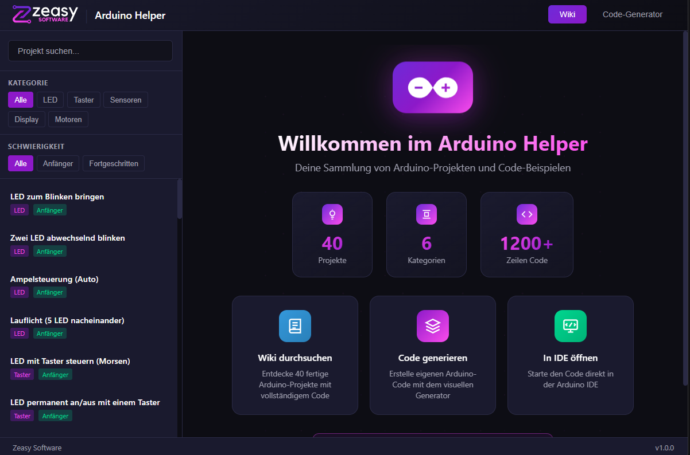

# Arduino Helper

> Ein offline-fähiges Arduino-Nachschlagewerk mit Code-Generator von **Zeasy Software**



---

## Features

- **40 Beispielprojekte** mit vollständigem Code und Erklärungen
- **Code-Generator** - Erstelle Arduino-Code durch einfache Regeln
- **Schaltplan-Generator (Beta)** - Automatische Breadboard-Diagramme
- **Arduino IDE inklusive** - Portable IDE ist bereits dabei!
- **100% Offline** - Läuft komplett ohne Internet vom USB-Stick

## Schnellstart

### Download & Installation

1. **[Arduino-Helper.zip herunterladen](https://www.dropbox.com/scl/fi/vgne1slyua5zf6my077h8/Arduino-Helper.zip?rlkey=0zpgxk3wcm3teti4qp22wtmm5&st=1t3ksvdz&dl=0)**
2. ZIP-Datei auf deinen USB-Stick entpacken
3. `arduino-helper.exe` starten
4. Fertig! Die Arduino IDE ist bereits dabei.

---

## Installation auf USB-Stick

Eine ausführliche Schritt-für-Schritt Anleitung findest du in **[INSTALLATION.md](INSTALLATION.md)**

### Kurzanleitung

```
USB-Stick (z.B. E:\)
└── Arduino Helper\
    ├── Arduino Helper.exe    ← Hier starten!
    ├── arduino-ide\          ← Portable Arduino IDE
    │   └── arduino.exe
    ├── solutions\            ← 40 Projektdateien
    └── output\               ← Generierte Dateien
```

**Wichtig:** Der komplette Ordner muss zusammen bleiben! Die App sucht die Arduino IDE im Unterordner `arduino-ide/`.

---

## Verwendung

### Wiki durchsuchen

1. Klicke auf **"Wiki"** in der Navigation
2. Filtere Projekte nach Kategorie (LED, Taster, Sensoren, etc.)
3. Filtere nach Schwierigkeit (Anfänger/Fortgeschritten)
4. Klicke auf ein Projekt, um den Code anzuzeigen
5. Mit **"In Arduino IDE öffnen"** direkt bearbeiten

### Code generieren

1. Klicke auf **"Generator"** in der Navigation
2. Wähle Komponenten aus (LEDs, Taster, Sensoren, etc.)
3. Füge Regeln hinzu:
   - `WENN Taster1 gedrückt DANN LED1 an`
   - `WENN Lichtsensor < 300 DANN LED2 blinkt`
   - `WENN Temperatur > 25 DANN Summer an`
4. Klicke auf **"Code generieren"**
5. Wechsle zum **"Schaltplan"**-Tab für das Breadboard-Diagramm

---

## Projekt-Kategorien

| Kategorie | Anzahl | Beispiele |
|-----------|--------|-----------|
| LED | 12 | Blinken, Lauflicht, RGB-Farbwechsel, Fade, Ampel |
| Taster | 8 | Toggle, Morsen, Reaktionsspiel, Würfel, Entprellen |
| Sensoren | 10 | Lichtsensor, Temperatur, Ultraschall, PIR, Joystick |
| Display | 4 | LCD Text, Messwerte anzeigen, Animation |
| Motoren | 4 | Servo steuern, Stepper Motor, Drehrichtung |
| Kommunikation | 2 | Serial Monitor, Debugging |

---

## Systemanforderungen

| Komponente | Minimum |
|------------|---------|
| Betriebssystem | Windows 10 / 11 |
| Speicher (ohne IDE) | ~50 MB |
| Speicher (mit IDE) | ~700 MB |
| USB-Stick | USB 2.0+ (USB 3.0 empfohlen) |

---

## Entwicklung / Build

### Voraussetzungen

- [Node.js](https://nodejs.org/) (v18+)
- [Rust](https://rustup.rs/) (für Tauri)
- [Git](https://git-scm.com/)

### Repository klonen

```bash
git clone https://github.com/MagieAlex/Arduino-Helper.git
cd Arduino-Helper
```

### Dependencies installieren

```bash
npm install
```

### Entwicklungsserver starten

```bash
npm run tauri dev
```

### Produktions-Build erstellen

```bash
npm run tauri build
```

Die fertige `.exe` findest du in `src-tauri/target/release/`.

### Portable Version erstellen

Nach dem Build:

1. Kopiere `Arduino Helper.exe` aus `src-tauri/target/release/`
2. Erstelle die Ordnerstruktur:
   ```
   Arduino Helper/
   ├── Arduino Helper.exe
   ├── arduino-ide/          ← Portable Arduino IDE hier einfügen
   ├── solutions/            ← Aus dem Repository kopieren
   ├── data/                 ← Aus dem Repository kopieren
   └── output/               ← Leerer Ordner erstellen
   ```
3. Lade die [Portable Arduino IDE](https://www.arduino.cc/en/software) herunter und entpacke sie in `arduino-ide/`

---

## Tech Stack

- **[Tauri v2](https://tauri.app)** - Rust-basiertes Desktop Framework
- **[Vite](https://vitejs.dev)** - Frontend Build Tool
- **Vanilla JavaScript** - Kein Framework, pure Performance
- **Custom CSS** - Zeasy Software Branding

---

## Lizenz

Dieses Projekt ist für Bildungszwecke gedacht und darf frei verwendet werden.

---

## Mitwirken

Fehler gefunden? Feature-Idee?

1. Erstelle ein [Issue](https://github.com/MagieAlex/Arduino-Helper/issues)
2. Oder fork das Repo und erstelle einen Pull Request

---

**Zeasy Software** | Made with love for Arduino enthusiasts
